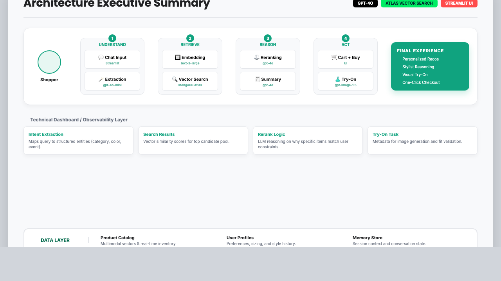

# RetailNext Intelligent Search (Streamlit Demo)

**Live demo (deployed):** `https://stylematchai.streamlit.app/`

A conversational retail demo with OpenAI Agents SDK + MongoDB Atlas vector search + multimodal reranking + virtual try‑on.

This repo includes **AGENTS.md**, which is compatible with OpenAI Codex and can be used to develop and iterate on the application.

## Code Walkthrough Links
Use these GitHub anchors jump directly to key sections in `app.py`:
- Configuration & constants: [`app.py#L50`](app.py#L50)
- Data access (MongoDB): [`app.py#L153`](app.py#L153)
- Intent extraction (Agents SDK): [`app.py#L218`](app.py#L218)
- Vector search: [`app.py#L328`](app.py#L328)
- Multimodal rerank (Agents SDK): [`app.py#L404`](app.py#L404)
- Try‑on pipeline: [`app.py#L541`](app.py#L541)
- Agent setup (intent, rerank, summary): [`app.py#L700`](app.py#L700)
- UI rendering (cards, try‑on panel): [`app.py#L803`](app.py#L803)
- Tech Demo tab (JSON + explanations): [`app.py#L1078`](app.py#L1078)
- Main flow orchestration: [`app.py#L1241`](app.py#L1241)

## Features
- Intent capture (category + color) with light conversational guidance
- Vector search (top 5) against MongoDB Atlas
- Multimodal reranking (event‑aware) with clear reasoning
- Conversational recommendations + add‑to‑cart + payment flow
- Virtual try‑on using OpenAI image generation

## Prerequisites
- Python 3.10+
- MongoDB Atlas database with collections:
  - `retail_demo.productAndEmbeddings`
  - `retail_demo.user_profiles`
  - `retail_demo.user_conversation_memory`
- Vector index named `vector_index` on the `embeddings` field
- OpenAI API key (org verification required for `gpt-4o` / `gpt-image-1.5`)

## Setup
1. Create a virtual environment:
   ```bash
   python -m venv .venv
   source .venv/bin/activate
   ```

2. Install dependencies:
   ```bash
   pip install -r requirements.txt
   ```

3. Set environment variables (or use a `.env` file):
   ```bash
   export OPENAI_API_KEY="..."
   export MONGODB_URI="..."
   ```

## Run
```bash
streamlit run app.py
```

## Architecture Diagram


Interactive version (GitHub Pages): `https://cozypet.github.io/styleMatchAI/architecture.html`


## Data Prep (Optional)
Scripts live in `dataprep/` and require `MONGODB_URI`.

- Data source (sample apparel catalog): `https://github.com/openai/openai-cookbook/tree/main/examples/data/sample_clothes`

- Attach GitHub raw image URLs to products:
  ```bash
  python dataprep/update_image_urls.py
  ```

- Add gender fields to user profiles:
  ```bash
  python dataprep/update_user_gender.py
  ```

## Notes & Troubleshooting
- If you see fewer than 5 vector results, the database may have fewer matching docs or the vector search is filtering too narrowly.
- If try‑on fails due to image loading, verify the product image URL is reachable over HTTPS.
- If you see OpenAI 403s for `gpt-4o` / `gpt-image-1.5`, verify your organization in the OpenAI dashboard.

## Project Structure
- `app.py`: Main Streamlit app
- `dataprep/`: Data generation and update scripts
